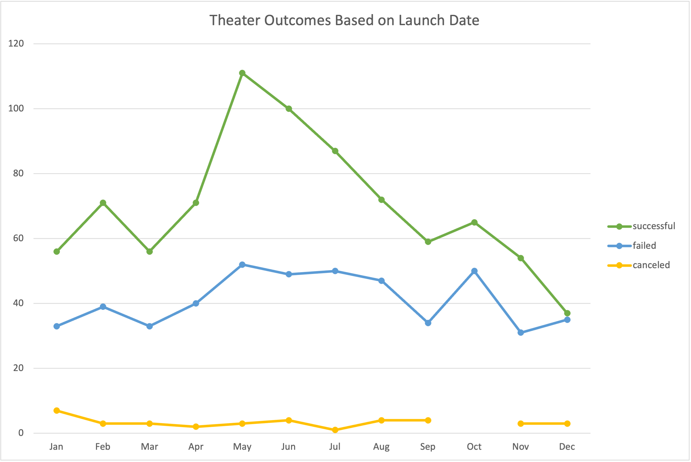
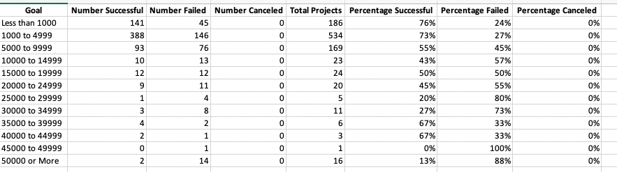
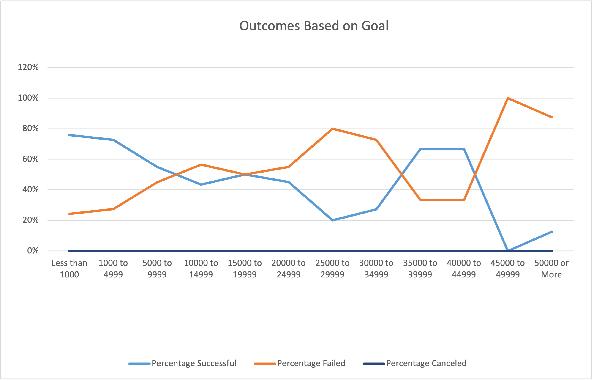

# An Analysis of Kickstarter Campaigns 

## Overview of Project

The purpose of this project is to provide two detailed analysis of the kickstarter dataset. The analysis provided will show the outcomes based on the launch dates and funding goals for plays, which will be represented as "Outcomes based on Goals" and the "Outcomes based on Launch Dates".

## Analysis and Challenges

Below the data and visualization charts are displayed. The first Analysis provided is the "Outcomes Based on Launch Date". This analysis will include a pivot table and line chart. 

### Analysis of Outcomes Based on Launch Date

I performed the Outcomes Bases on Launch Date analysis by first filtering the Kickstarter dataset by year. That was achieved by creating a new field and executing the year function. A Pivot table was created with the updated **Kickstarter** dataset, to display **Theater Outcomes by Launch Date**. The pivot table was filter by **Parent Category** and **year**. The results displayed are the number of **canceled**, **failed**, and **successful** theater projects by each month of the year. This data is portrayed in a line graph that is attached below, titled **Theater Outcomes Based on Launch Date**.

The information is displaying that the most successful theater projects were launched in May and June. There are **111** Successful projects in May and **100** Successful projects in June (reference above chart). 

### Challenges

One challenge I had to overcome was correctly displaying the Pivot table information. Some of the fields were autogenerated by excel when the new table was created. For example when the **"Date Created Conversion"** field is dropped into **"Rows"** the fields **Years2**, **Quarters** are auto generated. These can be removed by dragging them out of "Rows". 

Another challenge I faced was correctly displaying desired rows and column in the pivot table. There was a "(blank)" row and column present in the table. The way I removed them was by filtering the **row labels** and **column labels** to uncheck the "(blank)" box.

### Analysis of Outcomes Based on Goals

I performed the Outcomes based on goals analysis by creating a new table (Shown Below). This table is pulling information from the KickStarter Dataset to display the number of successful, failed, and canceled projects that fall within a certain fundraising "Goal" range for the subcategory "plays" only. This was done successful by entering a countifs statement and inputing the desired filters for each column.  The numbers are then converted into percentages of each category. 

From this table a line chart was created to display the trend between of the percentages of successful, failed, and cancelled plays that are between a certain range of fundraising goals. The chart is displayed below.

### Challenges

Once challenge that I had to overcome was creating the equations for the **Number Successful**, **Number Failed**, and **Number Canceled** columns. After learning how to input the **countifs()** statement correctly I attempted to copy the formula through to the next 2 columns. When pasted over the results read 0 and I realized my problem stemmed from not fixing the columns used in my formula that I pulled from the **Kickstarter sheet**. I fixed this by going back to **Number Successful** column and adding "**$**" signs to all used columns and then dragging the formulas over.  

## Results

**- What are two conclusions you can draw about the Outcomes based on Launch Date?**

Two conclusions that I can draw from the Outcomes based on Launch Date is if you would like to be successful in the theater category it is best to launch a campaign in the months of May and June. May has an average success rate of 66% out of the total shows that month and June has an average of 65% success rate of total shows that month. On the other end of the spectrum the worst time to launch a fundraising campaign is in October. This month has a low success rate and a high fail rate relative to the total shows in the month. The data reads that there is a 43% Fail rate and a 56% success rate, meaning half the campaigns launched that month were a success.  

**- What can you conclude about the Outcomes based on Goals?**

From the data analysis of outcomes based on goals I can conclude that projects that most projects has a goal of 1000 to 5000 dollars and 73% of those goals are successful. Goals with less than $1000 are also relatively successful with a 76% rate. Further reading the data, the higher you goal the more likely you are to fail at completely your goal. Although, when you look at a the financial goal of 35,000 - about 45,000 it only has a 1:3 fail to success ratio; Although there are only 9 projects that have attempted this goal. In total, that would put a 66% chance your goal would be successful. 

**- What are some limitations of this dataset?**
The limitations to this dataset is that it is only looking at theaters and plays, which is a limited amount of information, to determine how she when she she should start campaigns any how high she should set her goal. Although this is vital information there are other factors that plays a part in determining if Louise could be successful in her campaign by looking at where her play is going to be produced, what is the genre of her play and how long she plans to campaign. 

**- What are some other possible tables and/or graphs that we could create?**

You could use bar graphs to display the information from both sheets. You could display the number of successful, failed, or canceled projects or you could display the percentages of each category. I feel the bar graph would clearly convey the exact number of the projects in relation to Number Successful, failed, or canceled.  The same could be done for the theater outcomes based on Launch date. And instead of a pivot table being used to create information a table could have also been created and functions could be called to import data. 
